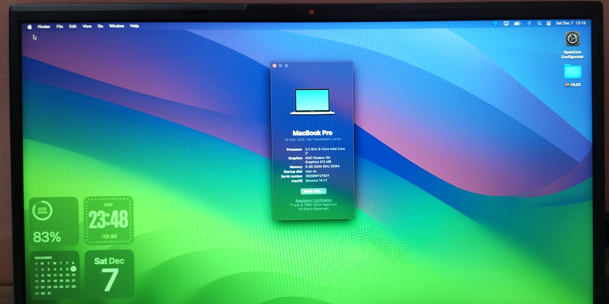

# ASUS Vivobook Pro 15 M6500QF Hackintosh

  

<h1 align="center">ASUS Vivobook Pro 15 M6500QF Hackintosh</h1>

  AMD Ryzen 5 5600H • OpenCore 1.0.3 • macOS Sonoma 14.7.1

  
  
  
  

---

## 📖 Overview

OpenCore EFI for the **ASUS Vivobook Pro 15 M6500QF** powered by an **AMD Ryzen 5 5600H**.

This EFI was developed and tested on real hardware and successfully runs **macOS Ventura** and **macOS Sonoma 14.7.1**.

The EFI was built from scratch using OpenCore, AMD-OSX resources, Dortania documentation, community discussions, and extensive testing on the target hardware.

---

## 💻 Hardware Specifications

| Component             | Details                      |
| --------------------- | ---------------------------- |
| 🖥️ Laptop            | ASUS Vivobook Pro 15 M6500QF |
| ⚙️ CPU                | AMD Ryzen 5 5600H            |
| 🎮 iGPU               | AMD Radeon Graphics          |
| 🚫 dGPU               | NVIDIA GeForce RTX 2050      |
| 🧠 RAM                | 8GB DDR4 3200MHz             |
| 💾 SSD                | Micron 2450 NVMe 512GB       |
| 📶 Internal Wi-Fi     | MediaTek MT7921              |
| 📡 USB Wi-Fi          | Realtek RTL8188FTV (802.11n) |
| 🔵 Bluetooth          | MediaTek Bluetooth Adapter   |
| 🔒 Fingerprint Reader | FocalTech Fingerprint Reader |
| 🍎 SMBIOS             | MacBookPro16,3               |
| 🔧 BIOS Version       | M6500QF.303                  |
| 🚀 OpenCore Version   | 1.0.3                        |

---

## 🍏 Tested macOS Versions

| Version             | Status         |
| ------------------- | -------------- |
| macOS Ventura       | ✅ Tested       |
| macOS Sonoma 14.7.1 | ✅ Daily Driver |

---

## ✅ What's Working

| Feature                         | Status                    |
| ------------------------------- | ------------------------- |
| ⚡ CPU Power Management          | ✅                         |
| 🎨 AMD Graphics Acceleration    | ✅                         |
| 🔊 Internal Speakers            | ✅                         |
| 🎙️ Microphone                  | ✅                         |
| 🔋 Battery Status               | ✅                         |
| 🌙 Sleep / Wake                 | ✅                         |
| ⌨️ Keyboard                     | ✅                         |
| 🖱️ Trackpad                    | ✅                         |
| ✌️ Multi-touch Gestures         | ✅                         |
| 💡 Brightness Control           | ✅                         |
| 🔌 USB Ports                    | ✅                         |
| 💾 NVMe SSD                     | ✅                         |
| 📺 HDMI Output                  | ✅                         |
| 📷 Webcam                       | ✅ *(minor startup delay)* |
| 🔀 Dual Boot                    | ✅                         |
| 📡 Realtek RTL8188FTV USB Wi-Fi | ✅                         |

---

## ❌ What's Not Working

| Feature                  | Status |
| ------------------------ | ------ |
| 📶 MediaTek MT7921 Wi-Fi | ❌      |
| 🔵 MediaTek Bluetooth    | ❌      |
| 🎮 NVIDIA RTX 2050       | ❌      |
| 🔒 Fingerprint Reader    | ❌      |

---

## 🌐 Networking

The built-in **MediaTek MT7921** wireless card is currently unsupported under macOS.

Internet connectivity was achieved using a:

**Realtek RTL8188FTV USB Wireless LAN Adapter (802.11n)**

---

## 🧩 Kexts Used

| Kext                          |
| ----------------------------- |
| AmdTscSync.kext               |
| AppleALC.kext                 |
| AppleMCEReporterDisabler.kext |
| Lilu.kext                     |
| NootedRed.kext                |
| VirtualSMC.kext               |
| VoodooPS2Controller.kext      |

---

## 📸 Gallery

### macOS Sonoma 14.7.1

  

### ASUS Vivobook Pro 15 M6500QF

  

---

## 🎥 Boot Demonstration

A complete boot demonstration from power-on to macOS login is available in:

**media/boot.mp4**

---

## 🛠️ Development Notes

This EFI was created specifically for the ASUS Vivobook Pro 15 M6500QF.

The biggest challenge during development was networking support because the built-in MediaTek MT7921 wireless card is unsupported by macOS.

The project was developed with help from:

* Dortania OpenCore Install Guide
* AMD-OSX Documentation
* Reddit Discussions
* YouTube Resources
* OpenCore Community Resources
* Extensive Real Hardware Testing

---

## ⚠️ Important Notes

* Generate your own SMBIOS before use.
* Remove all personal serial numbers before sharing.
* NVIDIA RTX 2050 is unsupported under macOS.
* MediaTek MT7921 Wi-Fi and Bluetooth are unsupported.
* This EFI is intended for users with similar hardware configurations.

---

## 🙏 Credits

* Acidanthera Team
* OpenCore
* Dortania OpenCore Install Guide
* AMD-OSX Community
* NootedRed Developers
* Lilu Developers
* VirtualSMC Developers
* Hackintosh Community

---

## 📝 Project Notes

This is my first public Hackintosh EFI repository.

The EFI was created for my personal ASUS Vivobook Pro 15 M6500QF and is shared to help users with similar hardware configurations.

Feedback, improvements, and issue reports are welcome.

If this repository helped you, consider giving it a ⭐.

---

## ⚖️ Disclaimer

This EFI is provided for educational and research purposes only.

I am not responsible for any data loss, hardware damage, software issues, or warranty voids resulting from the use of this EFI.

Use at your own risk.
